# ros_bridge -> ROS bridge for Carla Simulator
- ROS Bridge Driver for Carla Simulator package : https://github.com/carla-simulator/carla <br /> 
- Based on the code provided by the "ros-bridge" repository of CARLA: https://github.com/carla-simulator/ros-bridge <br />
- The goal of this ROS package is to provide a simple ROS bridge for CARLA simulator in order to be used for the ATLASCAR project of Aveiro University. <br />
- This repository is directly related to my Master's Thesis - "Semi-Automatic Labelling for Atlascar using Adaptive Perception" : https://silvamfpedro.github.io/ <br />

__Important Note:__

This documentation is for CARLA versions *newer* than 0.9.5.

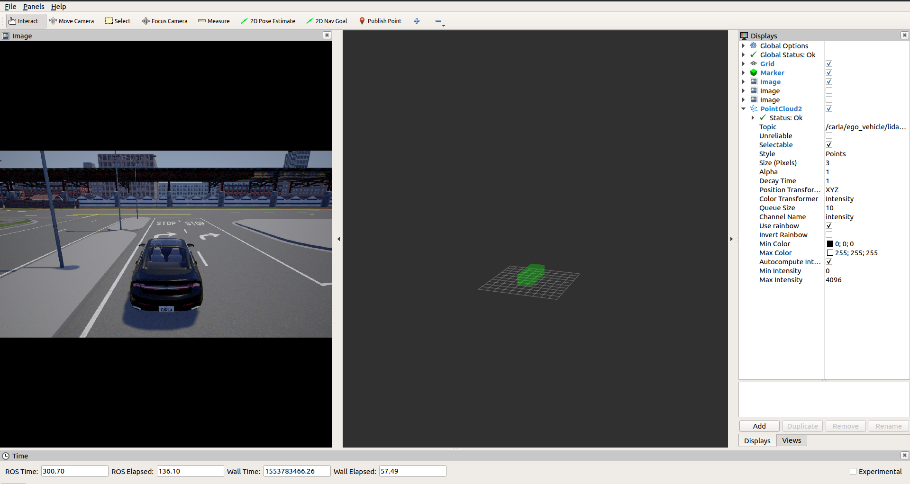
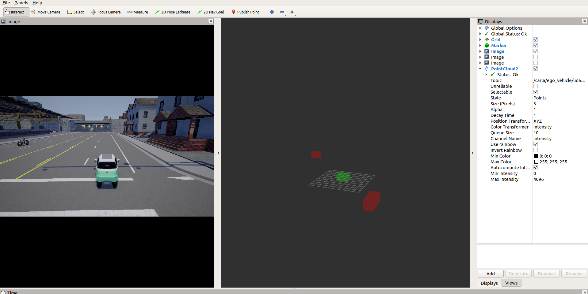
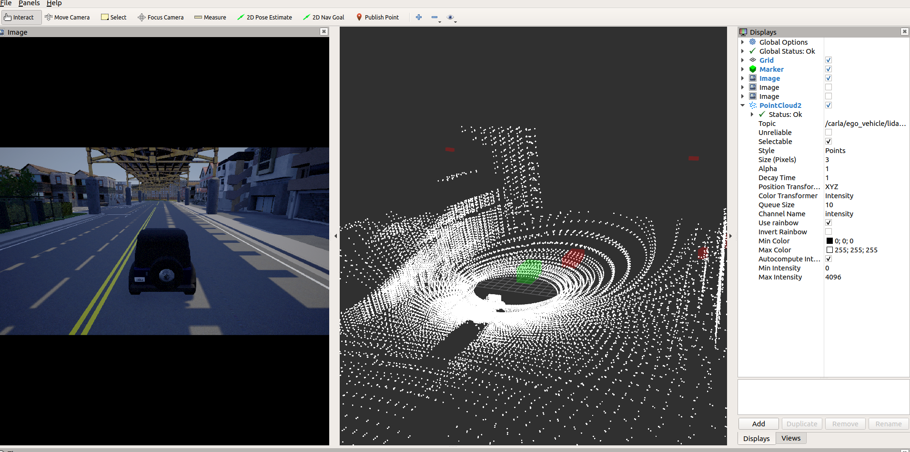

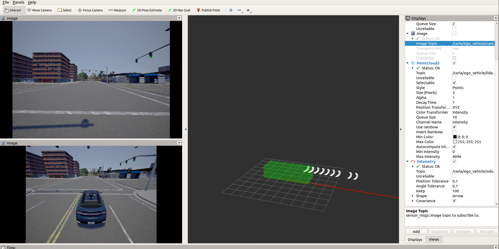
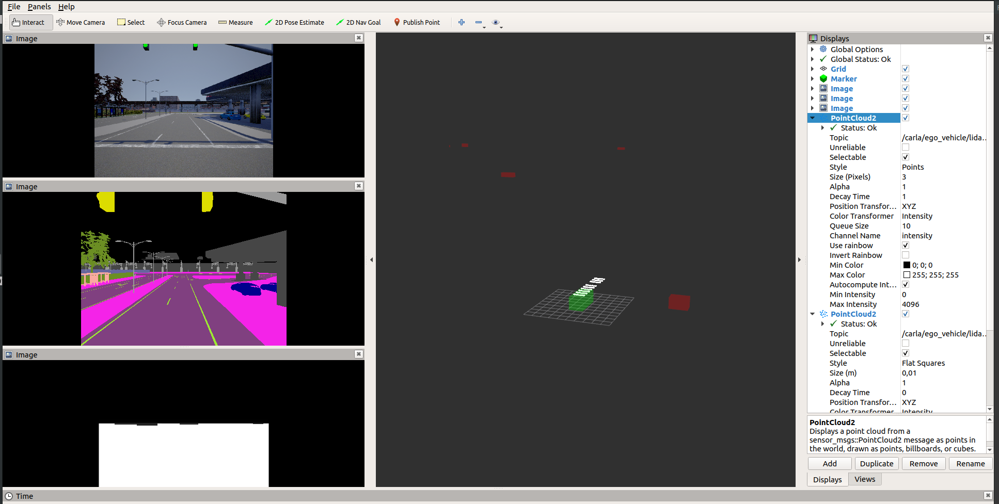
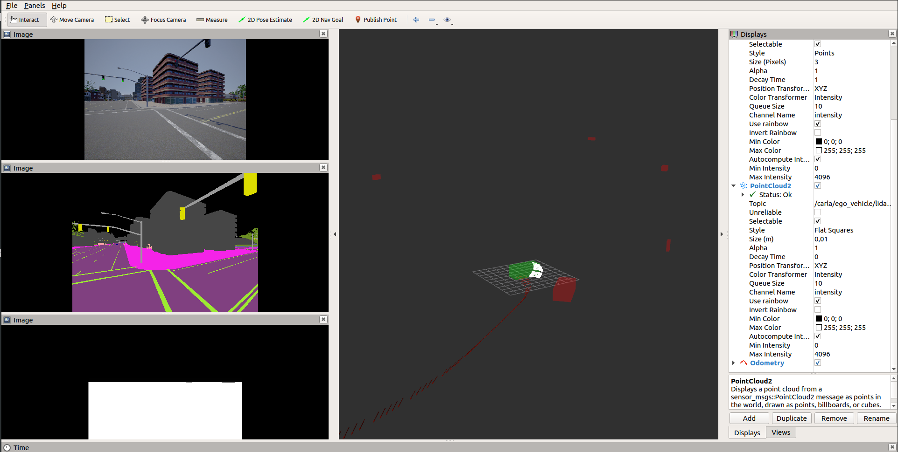
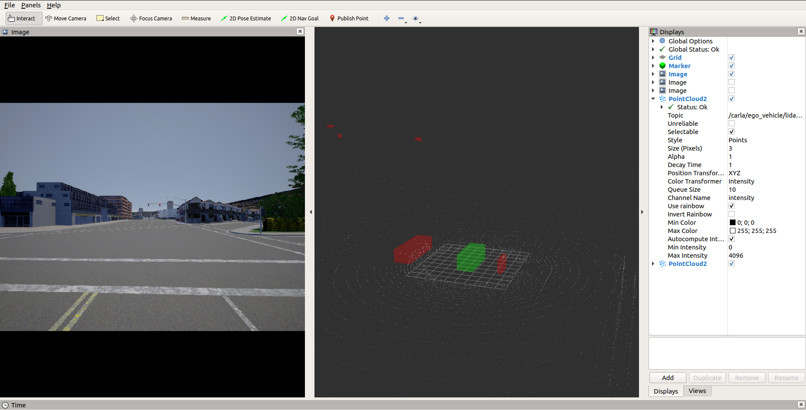
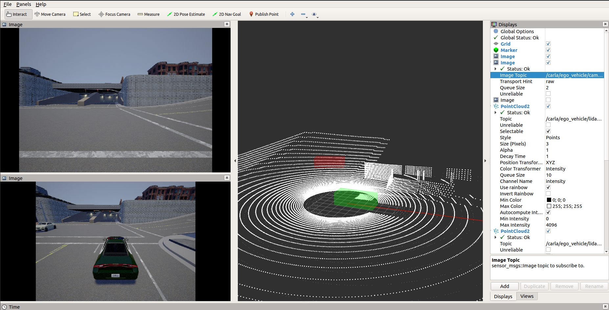
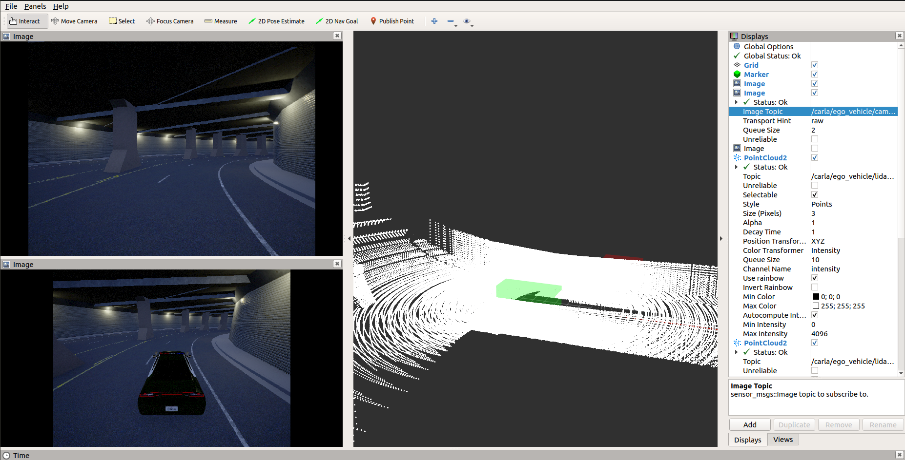
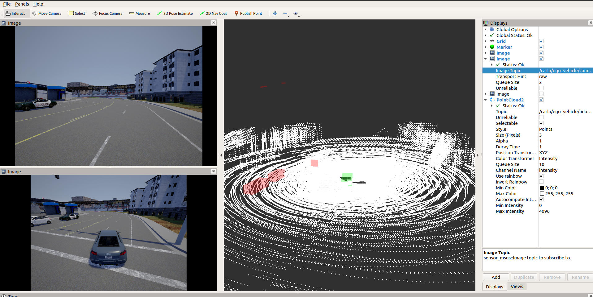
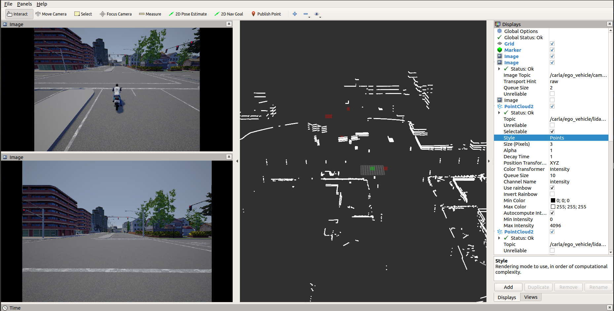
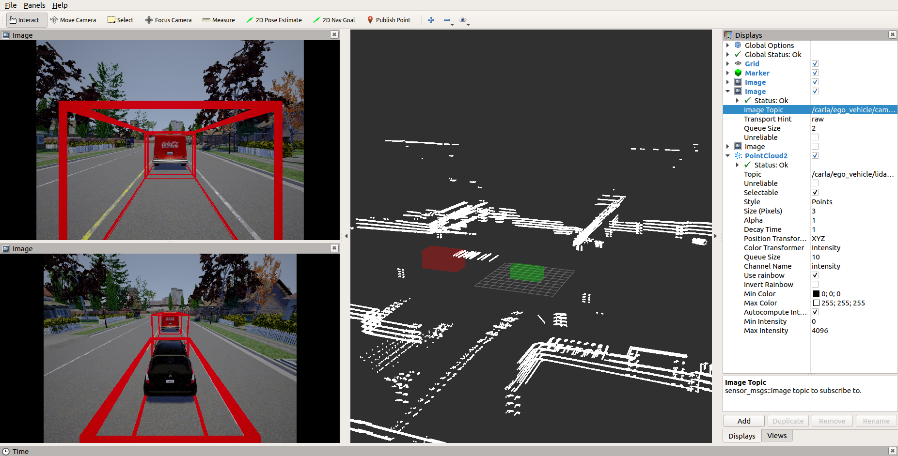
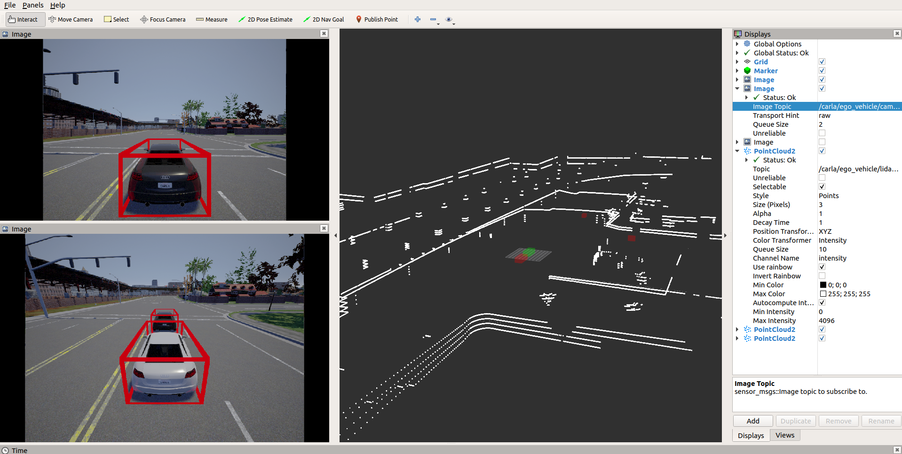

# Features
- [x] Cameras (depth, segmentation, rgb) support

- [x] Transform publications

- [x] Manual control using ackermann msg

- [x] Handle ROS dependencies

- [x] Marker/bounding box messages for cars/pedestrian

- [x] Lidar sensor support

- [x] Add traffic light support

- [ ] Rosbag in the bridge (in order to avoid rosbag record -a small time errors)

- [ ] ROS/OpenCV image convertion and Object Tracking using Template Matching.

# Setup


## Create a catkin workspace and install carla_ros_bridge package


First, clone or download the carla_ros_bridge, for example into


   ~/carla_ros_bridge


### Create the catkin workspace:


    mkdir -p ~/ros/catkin_ws_for_carla/src

    cd ~/ros/catkin_ws_for_carla/src

    ln -s ~/carla_ros_bridge .

    source /opt/ros/melodic/setup.bash

    catkin_make

    source ~/ros/catkin_ws_for_carla/devel/setup.bash


For more information about configuring a ROS environment see

http://wiki.ros.org/ROS/Tutorials/InstallingandConfiguringROSEnvironment


## Install the CARLA Python API


    export PYTHONPATH=$PYTHONPATH:<path/to/carla/>/PythonAPI/<your_egg_file>


Please note that you have to put in the complete path to the egg-file including

the egg-file itself. Please use the one, that is supported by your Python version.

Depending on the type of CARLA (pre-build, or build from source), the egg files

are typically located either directly in the PythonAPI folder or in PythonAPI/dist.


Check the installation is successfull by trying to import carla from python:


    python -c 'import carla;print("Success")'


You should see the Success message without any errors.


# Start the ROS bridge


First run the simulator (see carla documentation: http://carla.readthedocs.io/en/latest/)


    ./CarlaUE4.sh -windowed -ResX=320 -ResY=240 -benchmark -fps=10


Wait for the message:


    Waiting for the client to connect...


Then start the ros bridge:


    source ~/ros/catkin_ws/devel/setup.bash

    roslaunch carla_ros_bridge client.launch


To start the ros bridge with rviz use:


    source ~/ros/catkin_ws/devel/setup.bash

    roslaunch carla_ros_bridge client_with_rviz.launch
    
To start the ros bridge with rqt use:

    source ~/ros/catkin_ws/devel/setup.bash

    roslaunch carla_ros_bridge client_with_rqt.launch
    
To  start the ros bridge together with an example ego vehicle
    
    source ~/ros/catkin_ws/devel/setup.bash
    
    roslaunch carla_ros_bridge client_with_example_ego_vehicle.launch


You can setup the ros bridge configuration [carla_ros_bridge/config/settings.yaml](carla_ros_bridge/config/settings.yaml).


As we have not spawned any vehicle and have not added any sensors in our carla world there would not be any stream of data yet.


You can make use of the CARLA Python API script manual_control.py.

```

cd <path/to/carla/>

python manual_control.py --rolename=ego_vehicle

```

This spawns a carla client with role_name='ego_vehicle'. 

If the rolename is within the list specified by ROS parameter `/carla/ego_vehicle/rolename`, the client is interpreted as an controllable ego vehicle and all relevant ROS topics are created.


To simulate traffic, you can spawn automatically moving vehicles by using spawn_npc.py from CARLA Python API.

```

cd <path/to/carla/>

python spawn_npc.py

```

# Available ROS Topics


## Carla ROS Vehicle Setup

This package provides two ROS nodes:

- Carla Example ROS Vehicle: A reference client used for spawning a vehicle using ROS.
- Carla ROS Manual Control: a ROS-only manual control package.


### Carla Example ROS Vehicle

The reference Carla client `carla_example_ros_vehicle` can be used to spawn a vehicle (ex: role-name: "ego_vehicle") with the following sensors attached to it:

- GNSS
- 3 LIDAR Sensors (front + right + left)
- Cameras (one front-camera + one camera for visualization in carla_ros_manual_control)
- Collision Sensor
- Lane Invasion Sensor

Info: To be able to use carla_ros_manual_control a camera with role-name 'view' is required.

If no specific position is set, the vehicle shall be spawned at a random position.


### Spawning at specific position

It is possible to (re)spawn the example vehicle at the specific location by publishing to `/initialpose`.

The preferred way of doing that is using RVIZ:


Selecting a Pose with '2D Pose Estimate' will delete the current example vehicle and respawn it at the specified position.


### Create your own sensor setup

To setup your own example vehicle with sensors, follow a similar approach as in `carla_example_ros_vehicle` by subclassing from `CarlaRosVehicleBase`.

Define sensors with their attributes as described in the Carla Documentation about [Cameras and Sensors](https://github.com/carla-simulator/carla/blob/master/Docs/cameras_and_sensors.md).

The format is a list of dictionaries. One dictionary has the values as follows:

    {
        'type': '<SENSOR-TYPE>',
        'role_name': '<NAME>',
        'x': 0.0, 'y': 0.0, 'z': 0.0, 'roll': 0.0, 'pitch': 0.0, 'yaw': 0.0, # pose of the sensor, relative to the vehicle
        <ADDITIONAL-SENSOR-ATTRIBUTES>
    }

### Carla ROS Manual Control

The node `carla_ros_manual_control` is a ROS-only version of the Carla `manual_control.py`. All data is received
via ROS topics.

Note: To be able to use carla_ros_manual_control a camera with role-name 'view' needs to be spawned by `carla_ros_vehicle`.


### Manual steering

In order to steer manually, you might need to disable sending vehicle control commands within another ROS node.

Therefore the manual control is able to publish to `/vehicle_control_manual_override` ([std_msgs/Bool](http://docs.ros.org/api/std_msgs/html/msg/Bool.html)).

Press `B` to toggle the value.

Note: As sending the vehicle control commands is highly dependent on your setup, you need to implement the subscriber to that topic yourself.


### Odometry


|Topic                          | Type |
|-------------------------------|------|
| `/carla/<ROLE NAME>/odometry` | [nav_msgs.Odometry](http://docs.ros.org/api/nav_msgs/html/msg/Odometry.html) |


### Sensors


The vehicle sensors are provided via topics with prefix `/carla/<ROLE NAME>/<sensor_topic>`


Currently the following sensors are supported:


#### Camera


|Topic                                 | Type |
|--------------------------------------|------|
| `/carla/<ROLE NAME>/camera/rgb/<SENSOR ROLE NAME>/image_color` | [sensor_msgs.Image](http://docs.ros.org/api/sensor_msgs/html/msg/Image.html) |
| `/carla/<ROLE NAME>/camera/rgb/<SENSOR ROLE NAME>/camera_info` | [sensor_msgs.CameraInfo](http://docs.ros.org/api/sensor_msgs/html/msg/CameraInfo.html) |

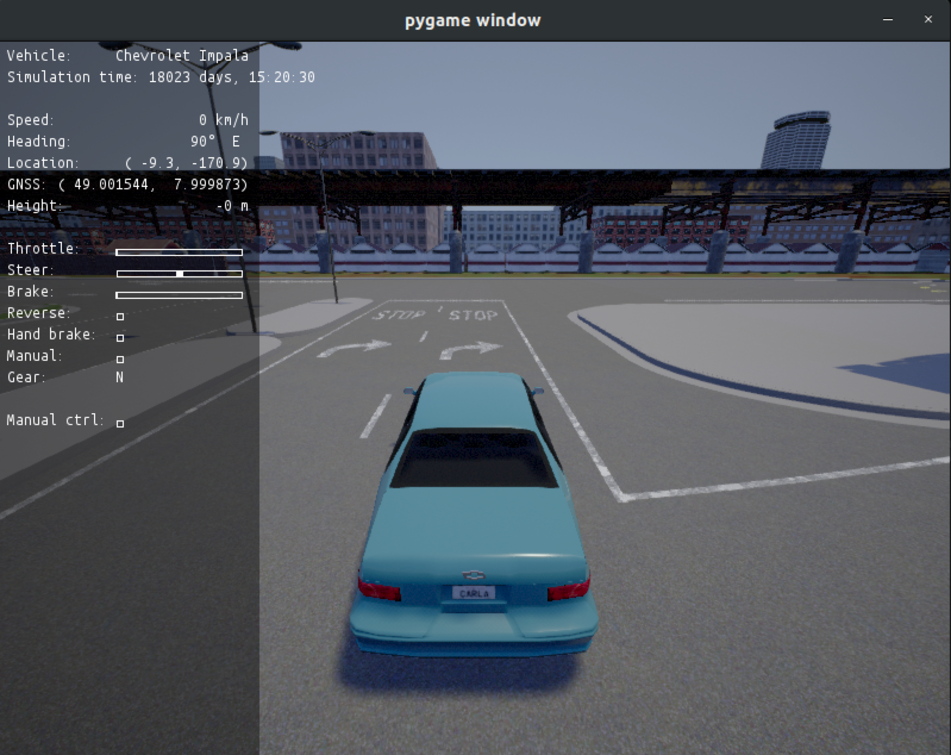
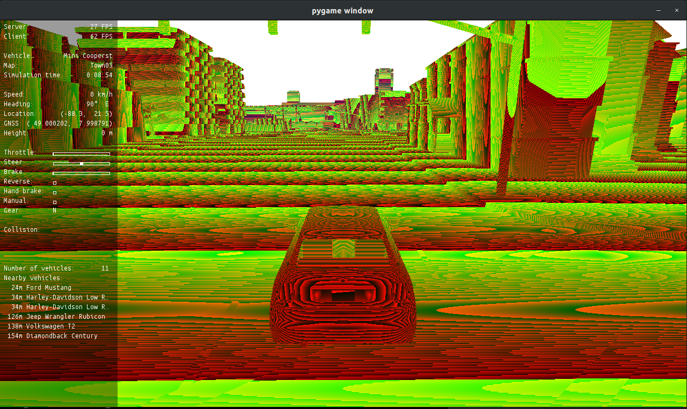
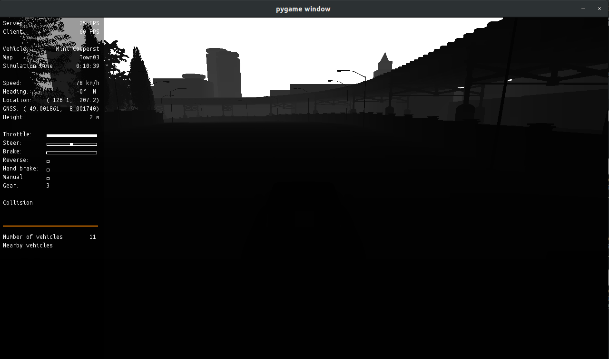
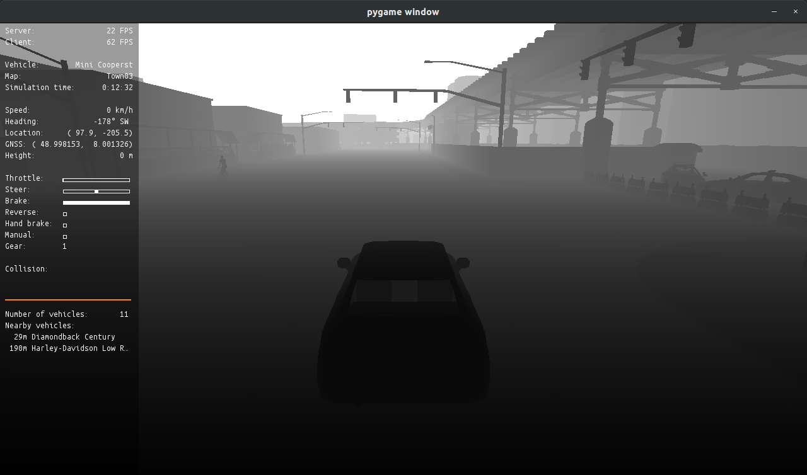
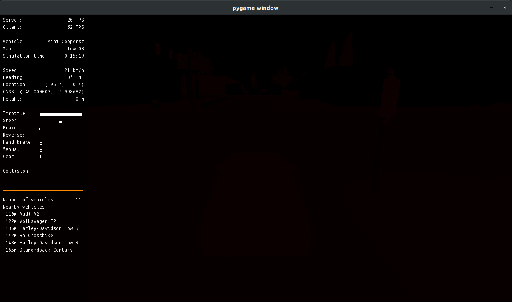
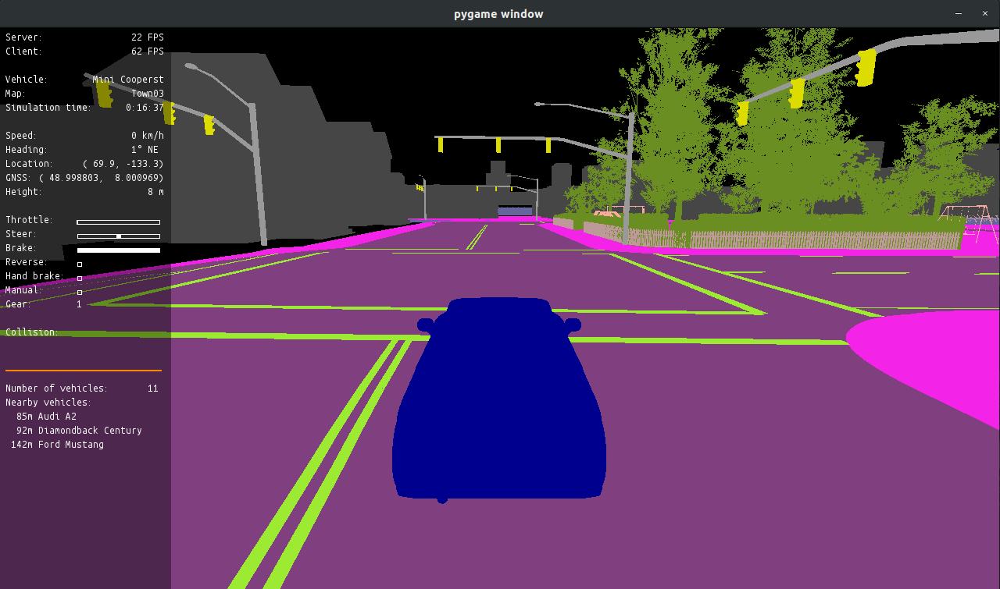


#### Lidar


|Topic                                 | Type |
|--------------------------------------|------|
| `/carla/<ROLE NAME>/lidar/<SENSOR ROLE NAME>/point_cloud` | [sensor_msgs.PointCloud2](http://docs.ros.org/api/sensor_msgs/html/msg/PointCloud2.html) |

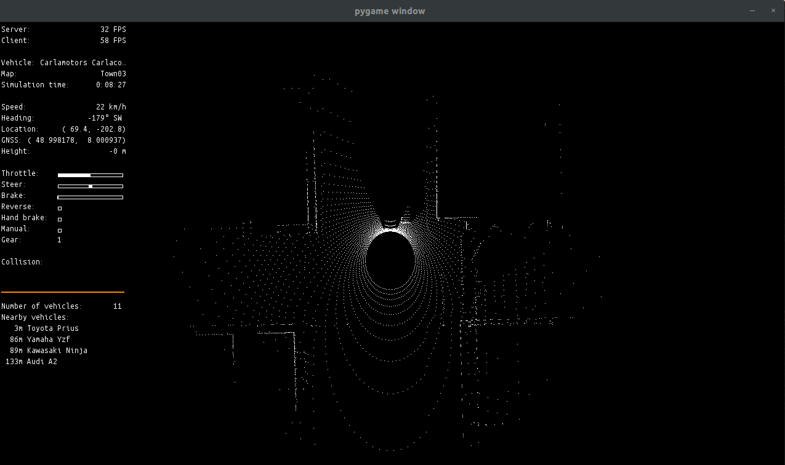


#### GNSS


|Topic                                 | Type |
|--------------------------------------|------|
| `/carla/<ROLE NAME>/gnss/front/gnss` | [sensor_msgs.NavSatFix](http://docs.ros.org/api/sensor_msgs/html/msg/NavSatFix.html) |


#### Collision Sensor


|Topic                          | Type |
|-------------------------------|------|
| `/carla/<ROLE NAME>/collision` | [carla_ros_bridge.CarlaCollisionEvent](carla_ros_bridge_msgs/msg/CarlaCollisionEvent.msg) |

#### Lane Invasion Sensor

|Topic                          | Type |
|-------------------------------|------|
| `/carla/<ROLE NAME>/lane_invasion` | [carla_ros_bridge.CarlaLaneInvasionEvent](carla_ros_bridge_msgs/msg/CarlaLaneInvasionEvent.msg) |

### Control


|Topic                                 | Type |
|--------------------------------------|------|
| `/carla/<ROLE NAME>/vehicle_control_cmd` (subscriber) | [carla_ros_bridge.CarlaEgoVehicleControl](carla_ros_bridge_msgs/msg/CarlaEgoVehicleControl.msg) |
| `/carla/<ROLE NAME>/vehicle_status` | [carla_ros_bridge.CarlaEgoVehicleStatus](carla_ros_bridge_msgs/msg/CarlaEgoVehicleStatus.msg) |
| `/carla/<ROLE NAME>/vehicle_info` | [carla_ros_bridge.CarlaEgoVehicleInfo](carla_ros_bridge_msgs/msg/CarlaEgoVehicleInfo.msg) |


You can stear the vehicle from the commandline by publishing to the topic `/carla/<ROLE NAME>/vehicle_control_cmd`.


Examples for a vehicle with role_name 'ego_vehicle':


Max forward throttle:


     rostopic pub /carla/ego_vehicle/vehicle_control_cmd carla_ros_bridge/CarlaEgoVehicleControl "{throttle: 1.0, steer: 0.0}" -r 10


Max forward throttle with max steering to the right:


     rostopic pub /carla/ego_vehicle/vehicle_control_cmd carla_ros_bridge/CarlaEgoVehicleControl "{throttle: 1.0, steer: 1.0}" -r 10


The current status of the vehicle can be received via topic `/carla/<ROLE NAME>/vehicle_status`.

Static information about the vehicle can be received via `/carla/<ROLE NAME>/vehicle_info`


# Carla Ackermann Control


In certain cases, the [Carla Control Command](carla_ros_bridge_msgs/msg/CarlaEgoVehicleControl.msg) is not ideal to connect to an AD stack.

Therefore a ROS-based node ```carla_ackermann_control``` is provided which reads [AckermannDrive](http://docs.ros.org/api/ackermann_msgs/html/msg/AckermannDrive.html) messages.

* A PID controller is used to control the acceleration/velocity.
* Reads the Vehicle Info, required for controlling from Carla (via carla ros bridge)

## Prerequisites

    #install python simple-pid
    pip install --user simple-pid

## Configuration

Initial parameters can be set via settings.yaml file.

It is possible to modify the parameters during runtime via ROS dynamic reconfigure.


## Available Topics

|Topic                                 | Type | Description |
|--------------------------------------|------|-------------|
| `/carla/<ROLE NAME>/ackermann_cmd` (subscriber) | [ackermann_msgs.AckermannDrive](http://docs.ros.org/api/ackermann_msgs/html/msg/AckermannDrive.html) | Subscriber for stearing commands |
| `/carla/<ROLE NAME>/ackermann_control/control_info` | [carla_ackermann_control.EgoVehicleControlInfo](msg/EgoVehicleControlInfo.msg) | The current values used within the controller (for debugging) |

The role name is specified within the configuration.

## Test control messages
You can send command to the car using the topic ```/carla/<ROLE NAME>/ackermann_cmd```.

Examples for a vehicle with role_name 'ego_vehicle':

Forward movements, speed in in meters/sec.

     rostopic pub /carla/ego_vehicle/ackermann_cmd ackermann_msgs/AckermannDrive "{steering_angle: 0.0, steering_angle_velocity: 0.0, speed: 10, acceleration: 0.0,
      jerk: 0.0}" -r 10


Forward with steering

     rostopic pub /carla/ego_vehicle/ackermann_cmd ackermann_msgs/AckermannDrive "{steering_angle: 1.22, steering_angle_velocity: 0.0, speed: 10, acceleration: 0.0,
      jerk: 0.0}" -r 10

Info: the steering_angle is the driving angle (in radians) not the wheel angle.

## Other Topics


### Object information of other vehicles


|Topic         | Type |
|--------------|------|
| `/carla/objects` | [derived_object_msgs.String](http://docs.ros.org/api/derived_object_msgs/html/msg/ObjectArray.html) |


Object information of all vehicles, except the ROS-vehicle(s) is published.


## Map


|Topic         | Type |
|--------------|------|
| `/carla/map` | [std_msgs.String](http://docs.ros.org/api/std_msgs/html/msg/String.html) |


The OPEN Drive map description is published.


# ROSBAG recording (not yet tested)


The carla_ros_bridge could also be used to record all published topics into a rosbag:


    roslaunch carla_ros_bridge client_with_rviz.launch rosbag_fname:=/tmp/save_session.bag


This command will create a rosbag /tmp/save_session.bag

You can of course also use rosbag record to do the same, but using the ros_bridge to do the recording you have the guarentee that all the message are saved without small desynchronization that could occurs when using *rosbag record* in an other process.

# Carla-ROS Bridge Messages

The node `carla_ros_bridge_msgs` is a ROS node used to store the ROS messages used in the ROS-CARLA integration.

## Message Files
The following ROS message files are used in the ROS-CARLA integration:
- CarlaCollisionEvent.msg
- CarlaEgoVehicleControl.msg
- CarlaEgoVehicleInfo.msg
- CarlaEgoVehicleInfoWheel.msg
- CarlaEgoVehicleStatus.msg
- CarlaLaneInvasionEvent.msg

# Carla-ROS Waypoint Publisher

Carla supports waypoint calculations.
The node `carla_waypoint_publisher` makes this feature available in the ROS context.

It uses the current pose of the ego vehicle with role-name "ego_vehicle" as starting point. If the
vehicle is respawned, the route is newly calculated.

## Startup

As the waypoint publisher requires some Carla PythonAPI functionality that is not part of the python egg-file, you
have to extend your PYTHONPATH.

    export PYTHONPATH=$PYTHONPATH:<path-to-carla>/PythonAPI/carla-<carla_version_and_arch>.egg:<path-to-carla>/PythonAPI/

To run it:

    roslaunch carla_waypoint_publisher carla_ros_waypoint_publisher.launch


## Set a goal

The goal is either read from the ROS topic /move_base_simple/goal, if available, or a fixed spawnpoint is used.

The prefered way of setting a goal is to click '2D Nav Goal' in RVIZ.


## Published waypoints 

The calculated route is published:

|Topic         | Type |
|--------------|------|
| `/carla/<ROLE NAME>/waypoints` | [nav_msgs.Path](http://docs.ros.org/api/nav_msgs/html/msg/Path.html) |

# ROS-OpenCV Image Convertion

The ```carla_ros_image_converter``` package is used to convert images from a ROS Topic to an OpenCV image by running the following command:


    roslaunch carla_ros_image_converter image_converter.launch


# Carla ROS Bounding Boxes

The ```carla_ros_image_converter``` package can be used to draw the bounding boxes around the objects present in the CARLA world according to their location/rotation and convert the results into an OpenCV image.


# Carla ROS Datasets

The position,location, orientation, rotation of these objects as well as a label for these objects can be recorded via a json file `data.json`.

The json format is defined like this:

    { 
        "vehicle" = [
            {
              "id": "<NAME>",
              "x": 0.0, "y": 0.0, "z": 0.0, "yaw": 0.0, # pose of the sensor, relative to the vehicle
              <ADDITIONAL-VEHICLE-ATTRIBUTES>
            },
            ...
        ]
    }

# Troubleshooting

## ImportError: No module named carla

You're missing Carla Python. Please execute:

    export PYTHONPATH=$PYTHONPATH:<path/to/carla/>/PythonAPI/<your_egg_file>

Please note that you have to put in the complete path to the egg-file including
the egg-file itself. Please use the one, that is supported by your Python version.
Depending on the type of CARLA (pre-build, or build from source), the egg files
are typically located either directly in the PythonAPI folder or in PythonAPI/dist.

Check the installation is successfull by trying to import carla from python:

    python -c 'import carla;print("Success")'

You should see the Success message without any errors.
